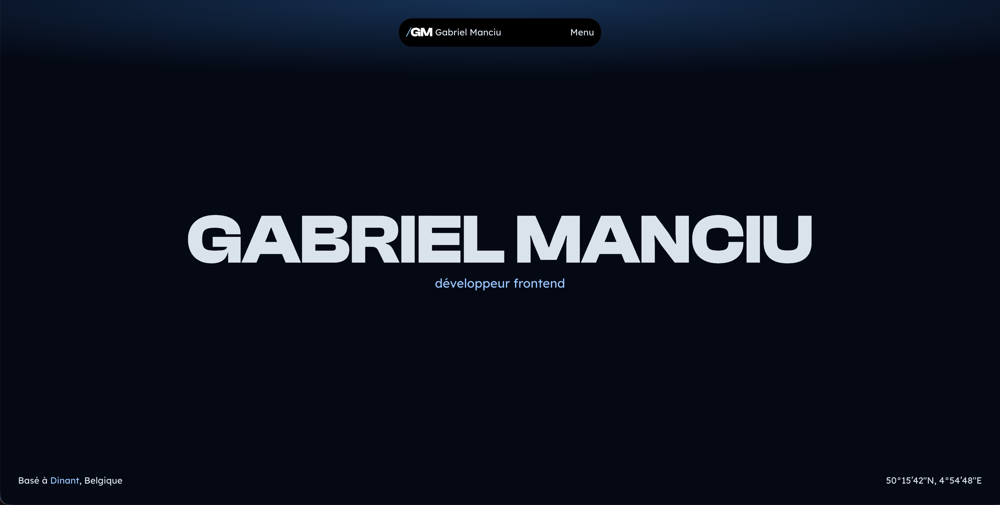

# Gabriel Manciu • Portfolio

  

  

---

## 📖 Sommaire

- [Stack Technique](#-stack-technique)
- [Contact](#-contact)

---

## 🛠️ Stack Technique

### Core & Framework

- **[Next.js 16](https://nextjs.org/)**
- **[React 19](https://react.dev/)**
- **[TypeScript](https://www.typescriptlang.org/)**

### Styles & UI

- **[Tailwind CSS v4](https://tailwindcss.com/)**
- **[SASS / SCSS Modules](https://sass-lang.com/)**
- **[Swiper](https://swiperjs.com/)** (Carrousels et sliders)

### Animations

- **[GSAP (GreenSock)](https://greensock.com/)** & `@gsap/react`
- GSAP Plugins : `ScrollTrigger`, `SplitText`

### Contenu & Markdown

- **[MDX](https://mdxjs.com/)** (`next-mdx-remote`, `@next/mdx`, `remark-frontmatter`, `remark-mdx-frontmatter`)

### Outillage & Qualité

- **[ESLint](https://eslint.org/)** & **[Prettier](https://prettier.io/)** (avec `prettier-plugin-tailwindcss`)

## 📬 Contact

- **LinkedIn** : [linkedin.com/in/gabriel-manciu](https://www.linkedin.com/in/gabriel-manciu/)
- **Email** : [gabriel@manciu.be](mailto:gabriel@manciu.be)
